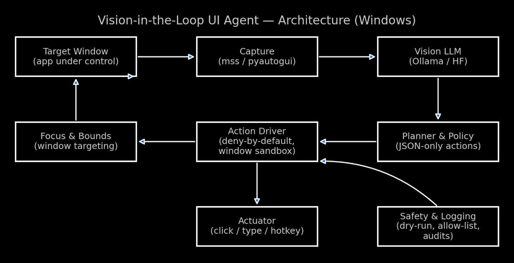

# Vision-in-the-Loop UI Agent
### Reads the screen like a human, then acts on Windows
#### Dr. John Hughes

A **vision-in-the-loop screen aware desktop agent** for Windows: reads screenshots, reasons over UI state, then clicks/types to achieve goals (opens files, exports reports, etc.).

> **Status:** WIP (design + prototype). Early runs use LLaMA-3.2-Vision (HF / Ollama) + lightweight action tooling.


<sub><i>Pixels in → parsed UI state → JSON-only action → sandboxed driver with allow-list, dry-run, and logs.</i></sub>

### Why
UI automation breaks when the DOM or control tree is hidden/opaque. A **vision-in-the-loop agent** can “see” pixels, reason about UI state, and take actions (click/type/hotkeys) toward a goal—even when classic RPA fails.

### What it does
- Grabs **screenshots** of a target window (optionally OCRs text).
- Feeds image + instruction to a **vision LLM** to parse state and propose next action.
- Executes **actions** (click/keys) with guardrails; repeats to completion.
- Runs in "**deny-by-default**" mode (allow-list + dry run)
  - **Audit**: dry-run only (prints planned actions, no clicks/keys)
  - **Confirm**: prompts before executing each action
  - **Auto-execute (sandboxed)**: executes allow-listed actions inside a focused window

### Roadmap
- **v0.1 (MVP):** One-app workflows (e.g., batch image conversion), focus-window sandbox, dry-run mode.
- **v0.2:** Multi-app flows, error recovery, tool memory.
- **v0.3:** Skill library, basic eval harness.

## Quickstart
```bash
git clone https://github.com/DrJohnHughes/vision-in-the-loop-ui-agent.git
cd vision-in-the-loop-ui-agent
```

### Option A — Ollama path (recommended to start)
```bash
# 1) Install Ollama (server) and pull a vision model
ollama pull llama3.2-vision:11b

# 2) Create environment
conda env create -f environment-ollama.yml
conda activate ui-agent
jupyter lab
```
OCR (optional): If you enable pytesseract, install the Tesseract binary and ensure it’s on PATH.

### Option B — Hugging Face path (direct Transformers)
```bash
conda env create -f environment-hf.yml
conda activate ui-agent
jupyter lab
```

##### Verify GPU support in the notebook
```python
import torch; print("torch", torch.__version__, "| cuda:", torch.cuda.is_available())
```

### Proof of Concept (Notebook)
See [01_screen_read_and_parse.ipynb](01_screen_read_and_parse.ipynb) for an example minimal loop (JSON):
- capture → caption → action.

### Safety & Guardrails

- Focused-window sandbox: the agent only clicks inside a whitelisted window.
- Dry-run mode: prints actions without executing.
- Allow-list: only permitted actions/keystrokes are executed; logging for every step.

### Planner & Policy

This repo ships a strict planner that forces **JSON-only** action outputs and a safe driver that executes an allow-listed subset of actions inside a focused window.

##### Files
- `src/planner/policy.py` — extracts the first JSON block from an LLM reply, validates it against `{action,target,coords,text,keys}`, and converts bad plans to `{"action":"noop"}`.
- `src/actions/driver.py` — deny-by-default action runner with a window sandbox and `--dry-run` behavior.

##### Usage
```python
from src.planner.policy import extract_and_validate_action
from src.actions.driver import ActionDriver

action = extract_and_validate_action(raw_text)   # raw LLM output → safe Action
# Audit / Confirm / Auto
driver = ActionDriver(window_title="My App", dry_run=True)
# driver = ActionDriver(window_title="My App", dry_run=False)  # Auto (use with care)
driver.run(action)
```

The planner’s system_prompt() also includes a JSON schema hint to reduce off-policy chatter:
```python
from src.planner.policy import system_prompt
print(system_prompt())
```

#### Smoke test without an LLM
```python
from src.planner.policy import extract_and_validate_action
from src.actions.driver import ActionDriver

fake_llm_reply = '{"action":"click","coords":[200,300]}'
action = extract_and_validate_action(fake_llm_reply)

driver = ActionDriver(window_title=None, dry_run=True)  # dry-run + no window sandbox for now
driver.run(action)  # should print a dry-run click
```

## Overview
Leveraging a **Vision LLM** such as LLaMA 3.2 Vision (Ollama) in Windows to drive autonomous UI agents using Vision-in-the-Loop screen-aware UI agent to react to what's on the screen by driving application actions. It interprets UI elements across different applications (PDFs, browser tabs, application output and menus), and performs actions based on natural language directives acting autonomously where possible. In short, it executes a **ReAct-style loop** that perceives the screen, reasons, acts and reflects.

Actions may include filling in forms, uploading documents, generating content and posting to social media, answering emails, editing video, refining audio, and more; all via language instruction.

Works like ChatGPT with tools carrying out instructions on your behalf but operating directly in the OS and interfacing with key applications.

Embodied AI agents go beyond simply processing data by learning, reasoning and interacting with abstract information sourced from multiple modalities. User interface Embodied AI Agents perceive diverse  information (images, video, audio, text, graphs, formulas, etc), reason and plan how best to use the data, and then autonomously act to fulfill requirements by controlling applications, querying language models and returning reports.

### Prototype
- Begin experimenting with Ollama version of LLaMA 3.2 Vision which can run locally with these advantages
  - Local and light so external API calls to external LLM services are not needed
  - Sensitive data never leaves local machine
  - Vision LLM can interpret visual data such as maps or graphs to decode into structured descriptions that can be analyzed, compared, and visualized
  - Easy to extend with additional functionality such as a Q&A interface
    - _“Which district is Woodland Hills now in?”_

- Investigate other open source models such as Qwen-VL to compare performance
- Initial applications to include:
  - extracting information from PDFs
  - interacting with websites by filling forms, extracting data, etc

### Proof of Concept 2: Exploring how redistricting impacts a location

- [02_poc_ui_agent.ipynb](02_poc_ui_agent.ipynb)

##### Sources
- Election Commission PDFs contain redistricting maps, text, and tables
- Screenshots of local maps exported from websites or GIS tools
- Access reference data such as census tract shapefiles, voting district shapefiles, demographic data

##### Pipeline
- Image/Text Extraction using LLaMA3.2-Vision (via Ollama) to parse:
   - Map images: detect district boundaries, labels, numbers
   - Embedded text: OCR-style reading of district names, population counts, etc
- Where possible make use of existing tools that can extract content from applications such as `pdfplumber` or `PyMuPDF` for PDFs.
- Feed extracted text and embedded images to LLaMA Vision for interpretation

##### Structure the Data

Convert LLaMA’s extracted text into a structured JSON format. For example:
```json
{
  "district": "CA-28",
  "area": "North Los Angeles",
  "changes": "Expanded west into Woodland Hills",
  "population_shift": "+3.2%"
}
```
##### Contextualize

- Pass structured data back to LLaMA (or a second reasoning step) with a system prompt:
  > Summarize how these redistricting changes affect north Los Angeles communities. Focus on Glendale, Burbank, North Hollywood, San Fernando Valley.

#### Outputs
- Readable summary (Markdown / plain text):
  “District 30 now includes Glendale and parts of Burbank, while North Hollywood shifts into District 29.”
- Comparison maps: overlay old vs. new boundaries (using geopandas + matplotlib).
- Local relevance filter: only highlight districts overlapping your zip code.


#### License: MIT

#### Topics
embodiedai multimodal vision-in-the-loop vision-llm agents rpa automation windows


### Repo structure
```bash
vision-in-the-loop-ui-agent/
├─ notebooks/
│  ├─ 01_screen_read_and_parse.ipynb
│  └─ 02_poc_ui_agent.ipynb
├─ src/
│  ├─ capture/      # screen grab, window bounding box
│  ├─ ocr/          # optional OCR
│  ├─ planner/      # prompts, JSON schema, loop policy
│  └─ actions/      # click/keys abstractions
├─ assets/
├─ environment-ollama.yml
├─ environment-hf.yml
├─ .gitignore
├─ LICENSE
└─ README.md
```
